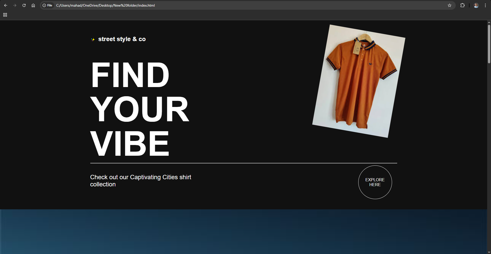
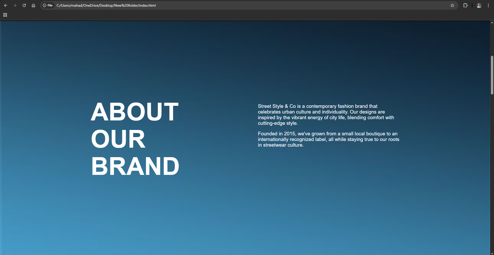
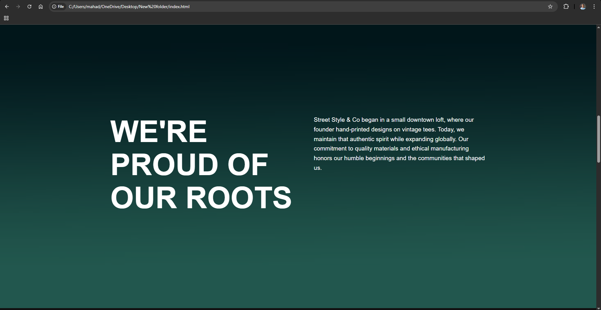
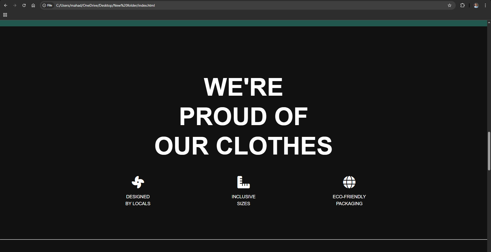
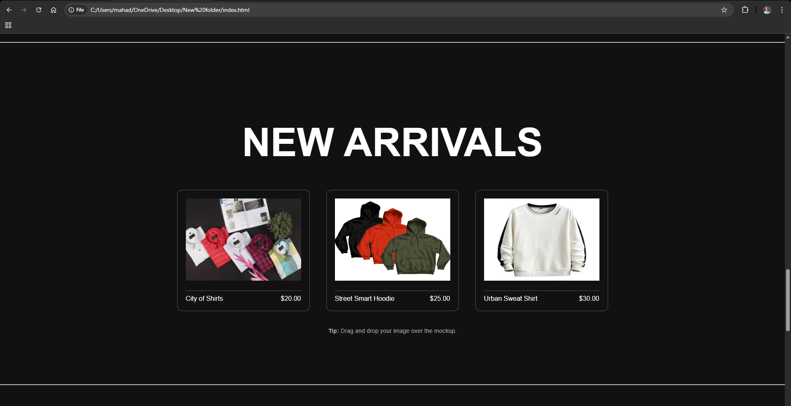
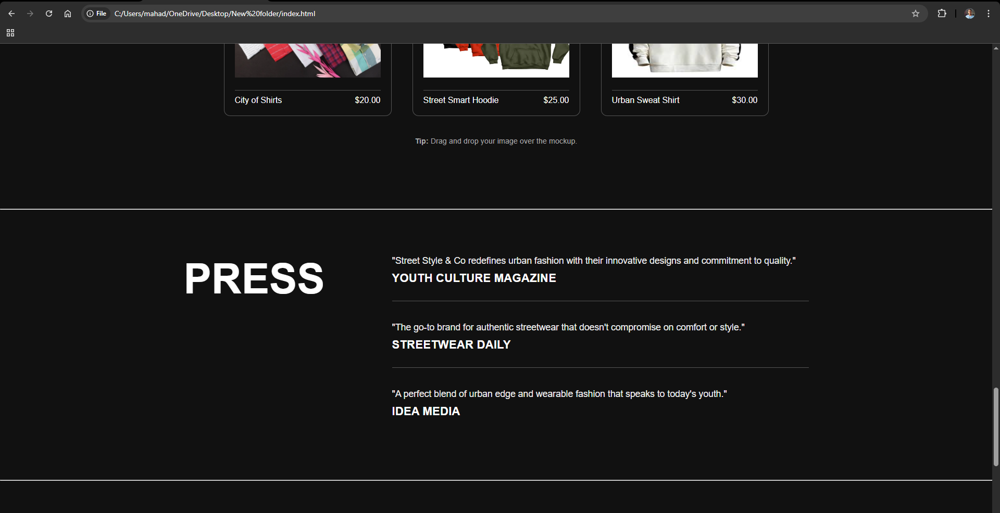

# Street Style & Co

Check out a few visuals from the website:

<table>
  <tr>
    <td></td>
    <td></td>
    <td></td>
    <td></td>
  </tr>
  <tr>
    <td></td>
    <td></td>
    <td></td>
  </tr>
</table>

A sleek, responsive streetwear fashion brand landing page made with pure HTML and CSS.  
This website captures the bold, urban vibe of **Street Style & Co**, featuring new arrivals, brand story, and contact details — all in one scroll.

## Features

-  Bold and minimalistic hero section
-  About the brand + origin story
-  New Arrivals section with products
-  Press shout-outs
-  Contact section with social links
-  "Proud of Our Clothes" feature section
-  Fully responsive for mobile & tablet
-  Clean and modern UI with Font Awesome icons
